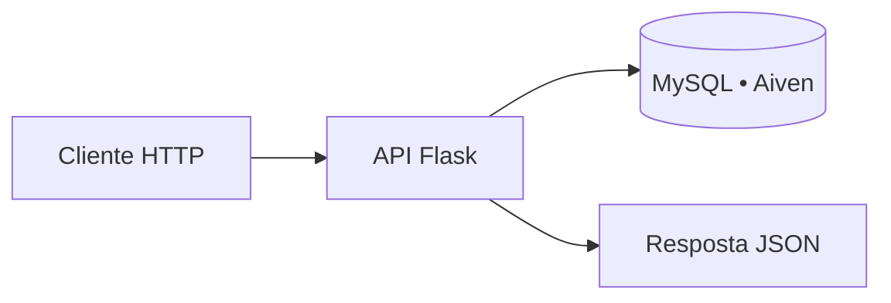

<div align="center">

# 🏠 API RESTful de Imóveis

### Gestão de imóveis com Flask, MySQL/Aiven, TDD e deploy na AWS

[](http://54.209.228.101/imoveis)
[](https://www.python.org/)
[](https://flask.palletsprojects.com/)
[](#entrega-a)

## 🚀 [Acessar a API em produção](http://54.209.228.101/imoveis)

**Equipe:** [Lucas Ibanez](#equipe) · [Vitor Oliveira](#equipe)

</div>

---

## ✨ Sobre o projeto

Esta é uma API RESTful para cadastro, consulta, atualização e remoção de imóveis. A aplicação foi construída com **Flask**, persiste os dados em um banco **MySQL hospedado na Aiven**, é testada com **pytest** e está publicada em uma instância **EC2 da AWS**.

O recurso central da API é `imoveis`, consumido por meio de respostas JSON e dos verbos HTTP apropriados.



## 🏆 Entrega A+

O projeto foi desenvolvido para atender ao conceito **A+** da rubrica da disciplina:

- 🧪 **TDD:** testes automatizados escritos com `pytest`, incluindo cenários de sucesso, validação, erros e integração simulada com o banco;
- 🌐 **API RESTful:** recursos identificados por URLs, uso de `GET`, `POST`, `PUT` e `DELETE`, além de respostas JSON;
- 🗄️ **Persistência real:** comunicação segura com MySQL hospedado na Aiven;
- ☁️ **Deploy:** aplicação disponível em uma instância EC2 na AWS;
- ✅ **Códigos HTTP semânticos:** `200`, `201`, `400`, `404` e `500`;
- 📐 **Maturidade de Richardson:** nível 3, conforme os critérios da rubrica do projeto.

## 🛠️ Tecnologias

| Tecnologia | Uso no projeto |
| --- | --- |
| 🐍 Python | Linguagem principal |
| ⚗️ Flask | Framework web e definição da API |
| 🐬 MySQL | Banco de dados relacional |
| ☁️ Aiven | Hospedagem gerenciada do banco MySQL |
| 🧪 pytest | Testes automatizados e prática de TDD |
| 🔌 mysql-connector-python | Conexão entre Python e MySQL |
| 🔐 python-dotenv | Leitura segura das variáveis de ambiente |
| 🟠 AWS EC2 | Hospedagem da API em produção |

## 📡 API em produção

> **Base URL:** [`http://54.209.228.101`](http://54.209.228.101)

| Método | Rota | Descrição | Resposta de sucesso |
| --- | --- | --- | --- |
| `GET` | [`/imoveis`](http://54.209.228.101/imoveis) | Lista todos os imóveis cadastrados. | `200 OK` |
| `GET` | `/imoveis/<id>` | Retorna um imóvel pelo identificador. | `200 OK` |
| `POST` | `/imoveis` | Cadastra um novo imóvel. | `201 Created` |
| `PUT` | `/imoveis/<id>` | Atualiza todos os dados de um imóvel. | `200 OK` |
| `DELETE` | `/imoveis/<id>` | Exclui um imóvel. | `200 OK` |
| `GET` | `/imoveis/tipo/<tipo>` | Filtra imóveis por tipo. | `200 OK` |
| `GET` | `/imoveis/cidade/<cidade>` | Filtra imóveis por cidade. | `200 OK` |

### Tipos de imóvel aceitos

`casa` · `apartamento` · `terreno` · `casa em condominio`

## 🧾 Modelo de dados

Para criar ou atualizar um imóvel, envie todos os campos abaixo em JSON:

```json
{
  "logradouro": "Rua das Flores",
  "tipo_logradouro": "Rua",
  "bairro": "Centro",
  "cidade": "São Paulo",
  "cep": "01001-000",
  "tipo": "apartamento",
  "valor": 350000.00,
  "data_aquisicao": "2024-01-15"
}
```

## ✅ Códigos de resposta

| Código | Quando ocorre |
| --- | --- |
| `200 OK` | Consulta, atualização ou exclusão realizada com sucesso. |
| `201 Created` | Novo imóvel cadastrado com sucesso. |
| `400 Bad Request` | JSON inválido, campos obrigatórios ausentes ou tipo de imóvel inválido. |
| `404 Not Found` | Imóvel ou cidade solicitada não encontrada. |
| `500 Internal Server Error` | Falha durante a comunicação com o banco de dados. |

## 💻 Como executar localmente

### 1. Clone o repositório

```bash
git clone <URL_DO_REPOSITORIO>
cd projeto-2-prog-eficaz
```

### 2. Crie e ative um ambiente virtual

```bash
python -m venv .venv
```

<details>
<summary><strong>Ativação no Windows</strong></summary>

```powershell
.venv\Scripts\Activate.ps1
```

</details>

<details>
<summary><strong>Ativação no macOS/Linux</strong></summary>

```bash
source .venv/bin/activate
```

</details>

### 3. Instale as dependências

```bash
pip install -r requirements.txt
```

### 4. Configure as variáveis de ambiente

Copie o arquivo de exemplo para `.env` e preencha as credenciais da Aiven. **Nunca envie o arquivo `.env` ao repositório.**

```bash
cp .env.example .env
```

Exemplo de configuração:

```env
DB_USER=seu_usuario
DB_PASSWORD=sua_senha
DB_HOST=seu_host_aiven
DB_PORT=20980
DB_NAME=seu_banco
DB_SSL_CA=ca.pem
```

> O certificado definido em `DB_SSL_CA` é utilizado para a conexão TLS com a Aiven.

### 5. Inicie a API

```bash
python api.py
```

Em ambiente local, a API ficará disponível em [`http://127.0.0.1:5000/imoveis`](http://127.0.0.1:5000/imoveis).

## 🧪 Testes automatizados e TDD

Os testes estão em [`test_api.py`](test_api.py) e usam mocks para simular a conexão com o MySQL. Assim, eles verificam a lógica da API sem depender do banco Aiven durante a execução.

```bash
pytest -q
```

Os cenários cobertos incluem:

- configuração da conexão via variáveis de ambiente;
- listagem e busca de imóveis;
- criação, atualização e exclusão;
- validação de JSON e campos obrigatórios;
- filtros por tipo e cidade;
- respostas de erro e liberação de conexão/cursor.

O fluxo seguido é **Red → Green → Refactor**: primeiro o teste define o comportamento esperado, depois o código é implementado e, por fim, refatorado com os testes verdes.

## 🔎 Exemplos de uso

### Listar imóveis

```bash
curl http://54.209.228.101/imoveis
```

### Cadastrar um imóvel

```bash
curl -X POST http://54.209.228.101/imoveis \
  -H "Content-Type: application/json" \
  -d '{
    "logradouro": "Rua das Flores",
    "tipo_logradouro": "Rua",
    "bairro": "Centro",
    "cidade": "São Paulo",
    "cep": "01001-000",
    "tipo": "apartamento",
    "valor": 350000.00,
    "data_aquisicao": "2024-01-15"
  }'
```

### Filtrar por tipo

```bash
curl http://54.209.228.101/imoveis/tipo/apartamento
```

### Filtrar por cidade

```bash
curl "http://54.209.228.101/imoveis/cidade/S%C3%A3o%20Paulo"
```

## 📁 Estrutura do repositório

| Arquivo | Responsabilidade |
| --- | --- |
| `api.py` | Endpoints Flask, validações e operações CRUD. |
| `connect_db.py` | Configuração e abertura da conexão TLS com MySQL/Aiven. |
| `test_api.py` | Suíte de testes automatizados com pytest. |
| `requirements.txt` | Dependências da aplicação e dos testes. |
| `.env.example` | Modelo das variáveis de ambiente necessárias. |
| `ca.pem` | Certificado usado na conexão segura com a Aiven. |

## 🔐 Boas práticas de segurança

- Mantenha credenciais somente em `.env` ou em variáveis de ambiente do servidor.
- Preserve `.env` no `.gitignore`.
- Não exponha senhas, tokens ou dados de conexão em commits, logs ou documentação.
- Use o certificado CA configurado para estabelecer conexão segura com o banco Aiven.

## 👥 Equipe

| Integrante | Papel no projeto |
| --- | --- |
| **Lucas Ibanez** | Desenvolvimento da API, testes e deploy. |
| **Vitor Oliveira** | Desenvolvimento da API, testes e documentação. |

---

<div align="center">

Feito com 💙, Python e boas práticas de desenvolvimento.

[⬆ Voltar ao topo](#api-restful-de-imóveis)

</div>
